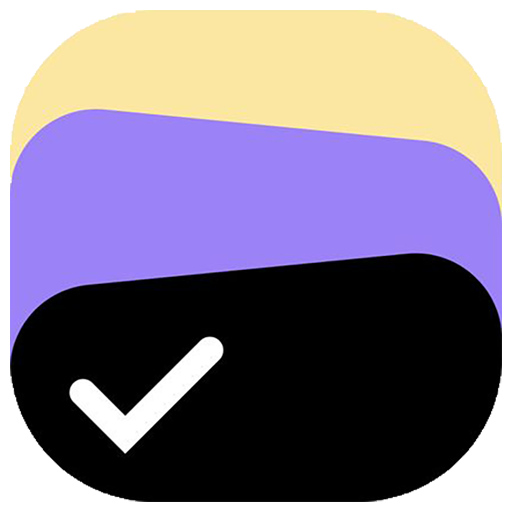

# 📝 یادداشت‌یار

**مدیریت یادداشت‌ها و کارهای زمان‌دار با تقویم شمسی**

ساخته‌شده با Vanilla JavaScript و IndexedDB

[English](#-english-version) · [فارسی](#-درباره-پروژه)

---

## 📌 درباره پروژه

**یادداشت‌یار** یک اپلیکیشن **مدیریت یادداشت‌ها و کارهای زمان‌دار** است که کاملاً **سمت کلاینت** و **Offline-First** طراحی شده است.

برخلاف یک To-Do ساده، این اپلیکیشن قابلیت **یادداشت‌گذاری آزاد**، **زمان‌بندی هوشمند** و **هشدارهای خودکار ددلاین** را فراهم می‌کند — همه این‌ها بدون نیاز به بک‌اند، دیتابیس ابری یا API خارجی.

تمام داده‌ها با **IndexedDB** در مرورگر ذخیره می‌شوند و **با بستن مرورگر از بین نمی‌روند**.

> این پروژه به‌عنوان یک نمونه Portfolio / Learning، روی **ذخیره‌سازی واقعی مرورگر**، **PWA** و **تجربه کاربری فارسی** تمرکز دارد.

---

## ✨ قابلیت‌ها

### 📝 یادداشت‌ها و کارها
- ✍️ **ایجاد یادداشت** با عنوان، توضیحات و ددلاین اختیاری
- ✏️ **ویرایش** کامل یادداشت‌ها
- 🗑️ **حذف** با تأیید دو مرحله‌ای
- ☑️ **علامت‌گذاری** به‌عنوان انجام‌شده / نشده
- 🔍 **جستجوی زنده** در تمام یادداشت‌ها
- 🎯 **فیلتر** انجام‌شده‌ها

### ⏰ زمان‌بندی و هشدار
- 📆 **تقویم شمسی** برای انتخاب ددلاین
- ⏱️ **نمایش زمان باقی‌مانده** (X دقیقه دیگر / گذشته)
- 🎨 **بج‌های رنگی** برای وضعیت ددلاین:
  - 🔵 عادی (> ۳ روز)
  - 🟡 نزدیک (< ۳ روز)
  - 🟠 فوری (< ۲۴ ساعت)
  - 🔴 گذشته
- 🔔 **نوتیفیکیشن مرورگر** (Browser Notification)
- ⏲️ **بررسی خودکار** هر ۶۰ ثانیه
- ⚡ **هشدار هوشمند**: ۱ ساعت قبل + لحظه ددلاین

### 💾 ذخیره‌سازی
- تمام داده‌ها در **IndexedDB**
- **ماندگار** بعد از بستن مرورگر
- **کاملاً لوکال** — هیچ داده‌ای به سرور ارسال نمی‌شود
- **بدون نیاز به ثبت‌نام** یا احراز هویت

### 🎨 رابط کاربری
- 🌐 **کاملاً راست‌چین (RTL)** با فونت **وزیرمتن**
- 🌓 **دو تم**: روشن (آبی/سفید/سبز/قرمز) + تاریک (آبی/خاکستری)
- 📱 **Responsive** روی موبایل و دسکتاپ
- 🎬 **انیمیشن‌های نرم** و کارت‌های شیشه‌ای (Glassmorphism)
- 🎈 **دکمه شناور (FAB)** برای ایجاد سریع
- 📊 **نوار آماری** بالای صفحه

### 📄 خروجی PDF
- 🧾 **تولید فاکتور PDF** از تمام یادداشت‌ها
- 🎨 طراحی زیبا با هدر رنگی
- 📊 خلاصه آماری (کل / انجام‌شده / در انتظار)
- 🖋️ فونت **وزیرمتن** جاسازی‌شده
- 📅 تمام تاریخ‌ها **شمسی**

### 🚀 PWA (Progressive Web App)
- 📲 **نصب روی موبایل** مثل اپ نیتیو
- 🔌 **کار کامل آفلاین** با Service Worker
- 🎯 **Shortcuts** برای دسکتاپ
- 🌈 **Splash screen** اختصاصی
- 💾 **کش هوشمند** فایل‌های استاتیک

---

## 🛠️ تکنولوژی‌های استفاده‌شده

| تکنولوژی | کاربرد |
|----------|--------|
| **HTML5** | ساختار اپلیکیشن |
| **CSS3** | استایل، انیمیشن، Glassmorphism |
| **Bootstrap 5** | Responsive UI |
| **Vanilla JavaScript** | منطق برنامه (بدون فریم‌ورک) |
| **IndexedDB** | ذخیره‌سازی کلاینت‌ساید |
| **Service Worker** | پشتیبانی از حالت آفلاین |
| **Web App Manifest** | نصب به‌عنوان PWA |
| **jsPDF** | تولید فایل PDF |
| **Persian Datepicker** | انتخاب تاریخ شمسی |
| **Vazirmatn Font** | فونت فارسی |
| **Bootstrap Icons** | مجموعه آیکون |

> ⚠️ **هیچ فریم‌ورک جاوااسکریپتی** مثل React، Vue، Svelte یا Alpine.js استفاده نشده است.

---

## 📁 ساختار پروژه
